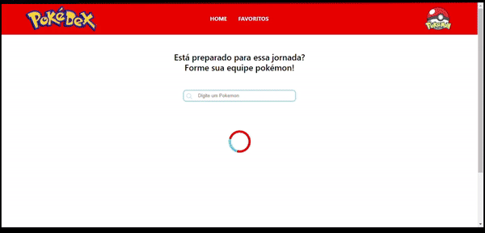
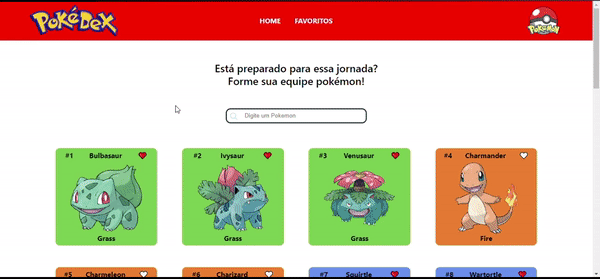
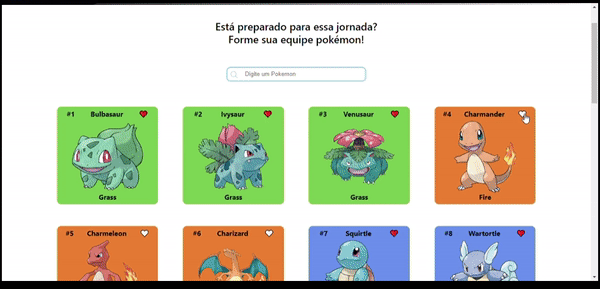

<h1 align="center">Pokédex</h1>
<p>Ao iniciar, temos uma lista completa com todos Pokemons. <br> É possível procurar por um Pokemon especifico. <br> Contamos também com um sistema de favoritos, seguindo a ideia do anime que cada treinador pode carregar consigo 6 Pokébolas por vez.</p>
<h4 align="center"> 
	🚧  React Select 🚀 Em construção...  🚧
</h4>

### Demonstração da aplicação
<div align="center">
  
</div>
<div align="center">
  
</div>
<div align="center">
  
</div>

Clique <a href="https://cardoso0.github.io/pokedex/" target="_blank">aqui</a> para visualizar o projeto no seu navegador

### 🎲 Rodando o projeto na sua maquina

```bash
# Clone este repositório
$ git clone https://github.com/cardoso0/pokedex

# Não esqueça de navegar até a pasta
$ cd pokedex

# Instale as dependências
$ npm install

# Execute a aplicação
$ npm run dev

```

### 🛠 Tecnologias

As seguintes ferramentas estão sendo usadas na construção do projeto:

- [HTML](https://www.w3schools.com/html/)
- [CSS com Styled Components](https://styled-components.com/)
- [React](https://pt-br.reactjs.org/)

### Autor
---
Feito com ❤️ por Felipe Cardoso 👋🏽 Entre em contato!

[](https://www.linkedin.com/in/felipe-pontes-cardoso-9b93401a0/) 
[](mailto:felipepontescardoso@yahoo.com.br)
